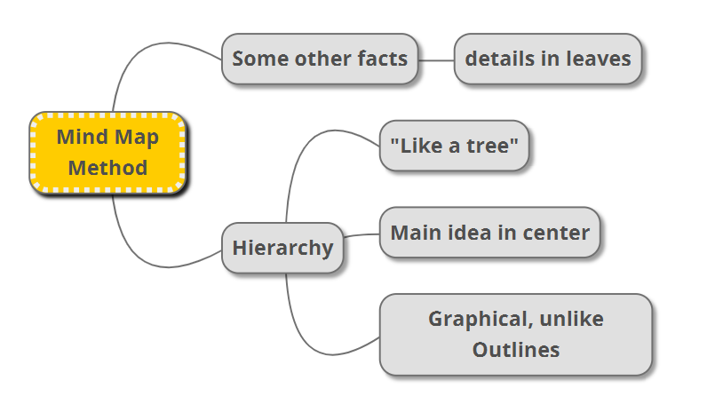

# How to take notes

1. Definitions
2. Examples

## Outline Method

- Bullet cascade
  - Details
- <mark>Formatting Tricks</mark>

## Cornel Method

- Three columns:
    1. Notes (e.g., outline)
    2. Cues (questions, diagrams, main ideas)
    3. Summary (overview)

## Mind Maps

